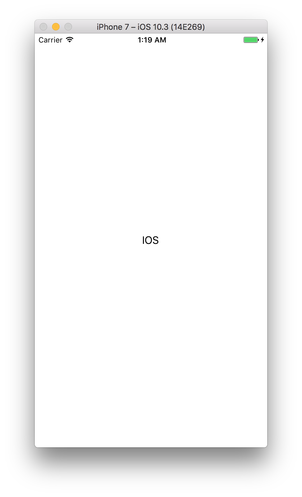
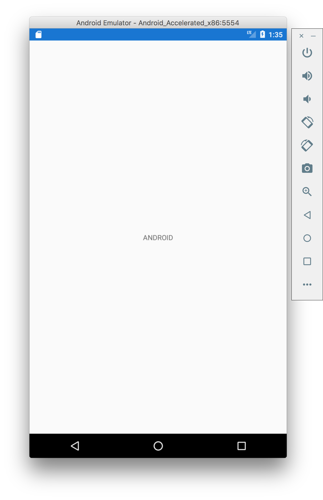

# Bait and Switch PCL example

An example of the Bait and Switch trick that I learned from Paul C Betts blog

## When do I use Bait and Switch?
I use the Bait and Switch PCL trick, if I need to create my own cross platform library.

## How does Bait and Switch work?
You got one solution with different library projects that you need. For example you have an Android library, an iOS library and a PCL. It's what this project uses as example.

Now, instead of using different folders for each project, you put all csproj files together in one. You will have to modify the sln and csproj files a little bit to make it work but its worth it once it's working.

Now you can create a new class for each project that you need with a different filename but the same class name and they all use the same interface. You can see this in my code: In the libs folder you will find my example library with a class that is called _AwesomeClass-Droid.cs_, there is also _AwesomeClass-iOS_ and _AwesomeClass-PCL_ in there. If you look closer, their class names are always the same: _AwesomeClass_ and they all use the same interface _IAwesomeClass_. With that little trick the compiler will choose at runtime what class to use.

## What are the advantages?
The Bait and Switch PCL trick is saving you a lot of ugly compiler directives. Therefore it is highly increasing the maintenance of any library project you are working on.

## What is my example doing?
In my example I created a library that is telling you, if you are currently on iOS or Android. This is just an example. Keep in mind that you will probably do more fancy stuff than I did. Important is that you are able to return something different for an Android project than you are doing for an iOS project without using compiler directives and that only with a single method from your shared code.

## iOS

## Android

